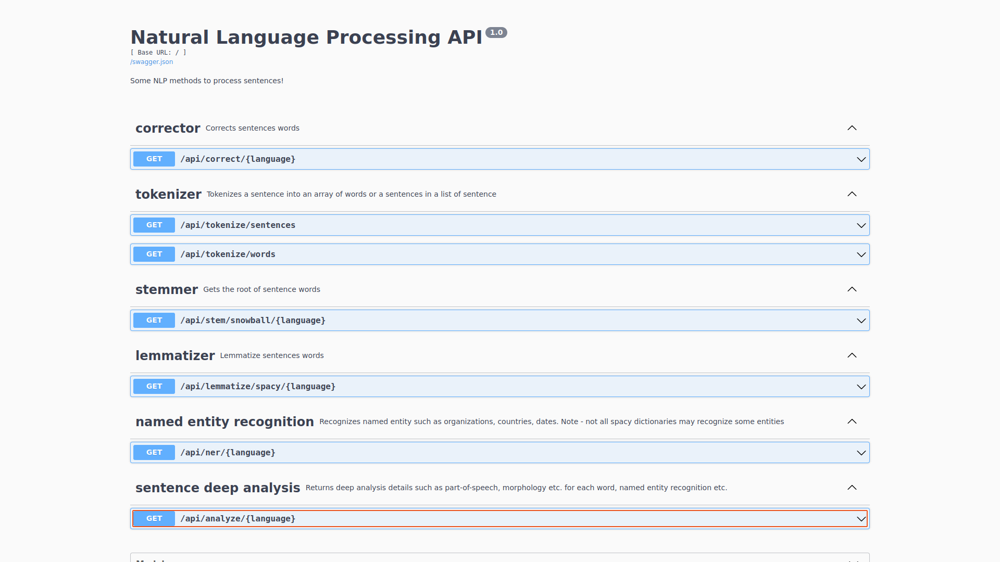
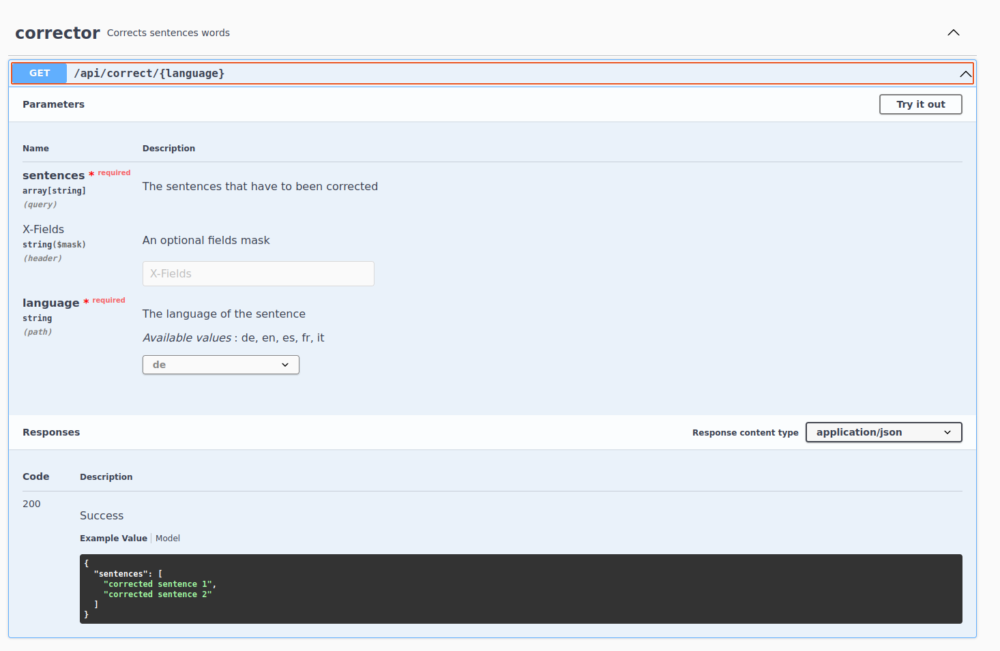
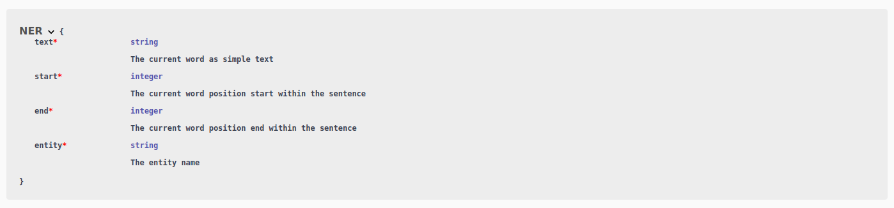

A Nlp-rest service 
========================

This is a basic rest API service made with python [flask](https://flask.palletsprojects.com/en/2.2.x/) with an easy Swagger interface made with [flask_restx](https://flask-restx.readthedocs.io/en/latest/). 
It handles some different Natural Language Processing functions such as:

* correction, using
    - [pyEnchant](https://pyenchant.github.io/pyenchant/), a library for spellchecking based on [Enchant](https://abiword.github.io/enchant/) thant uses some [aspell](https://ftp.gnu.org/gnu/aspell/dict/0index.html) language dictionaries
* tokenization, divide sentence word-token list or sentences in senteces-list. Using
   - [NLTK](https://www.nltk.org/), a powerfull set of natural language tools. 
* lemmantization, using
    - [spaCy](https://spacy.io/), for me the best library, at the moment, that contains a full set of tools to manage words tokenization, word lemmatization, deep text analysis, part-of-speech and named entity recognition. The real problem for these types of library is the multi language affidability. And spaCy is very very reliable. 
* stemming, take the root of a word, using 
    - [NLTK](https://www.nltk.org/), with SnowballStemmer algorithm
* deep analysis, that provides:
    - Part-Of-Speech detection
    - Language detection
    - Named Entity Recognition
    - Morphology detection
    - Sentiment analysis

Requirements 
========================

* Python 3.8.10
* Docker (if you want to use the nlp-rest docker image)

Development configuration 
========================

1. I raccomend to build and use a python virtual environment to not modify your own global environment (_note I'm using VSCode on Ubuntu 20.04 OS_). To do this, once cloned the .git repo, open VSCode and in its terminal type  


```Shell
python3 -m venv /path/to/new/virtual/environment
```

Once you've created the virtual environment VSCode should prompt a message for select it as default python interpreter. If not with the VSCode command prompt (in my case `Ctrl-Shift-P`) choose `Python: select interpreter` and next select the interpreter in your virtual environment

Then, in the VSCode terminal activate the virtual environment typing 

```Shell
source /path/to/new/virtual/environment/bin/activate
```

For more informations about virtual environment you can take a look [here](https://docs.python.org/3/library/venv.html)

2. You need to set properly your virtual environment installing all the dependencies : there is a setup.py file, open it and take a look. Once you're in the virtual environment type

```Shell
pip install .
```

Docker configuration
========================

There is an image on DockerHub, you can use it downloading the image

```shell
sudo docker pull gigadr3w/nlp-rest
```

and run it, typing

```
sudo docker run -p "5000:5000" --name nlp_rest gigadr3w/nlp-rest
```

Supported languages
========================

At the moment it handles these language dictionaries:

* English
* French
* German
* Italian
* Spanish

Instruction
========================

Once started at your local, you can navigate on the default main url (i.e. http://localhost:5000) and then use the swagger interface as documentation.





